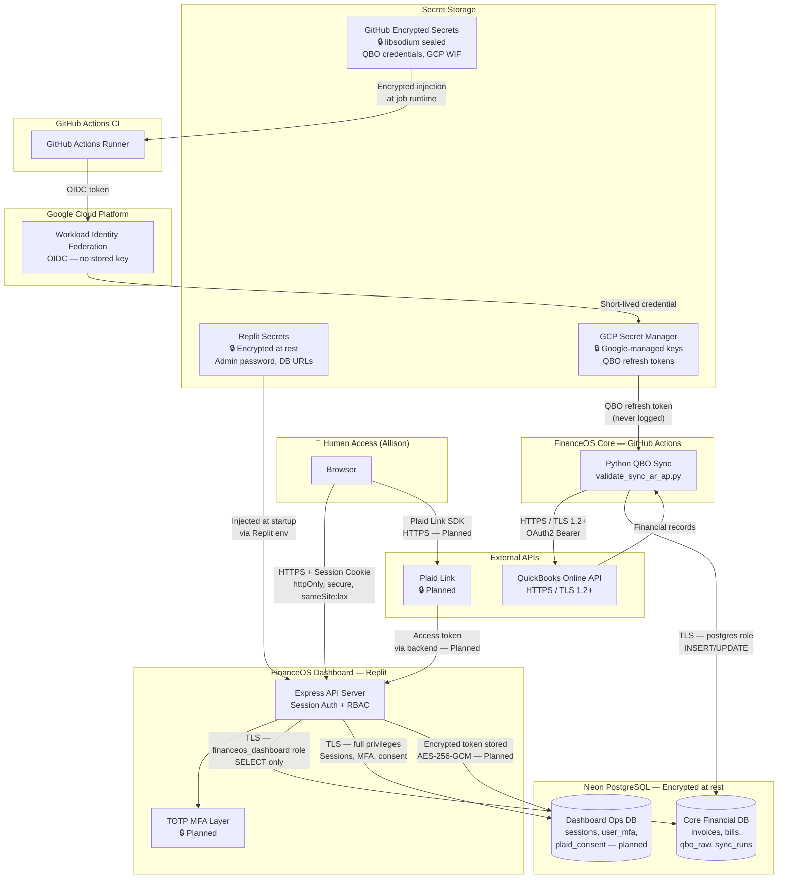

> **DRAFT — NOT YET APPROVED.** Effective date: [PENDING APPROVAL]

# FinanceOS Security Data Flow Diagram
**Version:** 0.1-draft  
**Date:** 2026-07-21

This diagram shows all data flows, authentication boundaries, encryption points, and storage for FinanceOS, including the planned Plaid integration.

No real credentials, tokens, or connection strings appear in this document.

---

## System Data Flow (Mermaid)

---

## Control Legend

| Symbol | Meaning |
|---|---|
| 🔒 | Encrypted channel or encrypted storage |
| 🔒 Planned | Control exists in code but not yet deployed |
| HTTPS / TLS 1.2+ | Transport encryption verified |
| OIDC | Short-lived token — no stored long-term credential |
| httpOnly, secure | Cookie flags preventing JS access and HTTP transmission |

---

## Authentication Boundaries

| Boundary | Auth Type | MFA Required | Notes |
|---|---|---|---|
| Browser → Dashboard | Session cookie (bcrypt password) | Planned (TOTP) | MFA gate being deployed |
| GitHub Actions → GCP | OIDC (Workload Identity Federation) | N/A — machine auth | No stored service account key |
| Core Pipeline → QBO | OAuth2 refresh token | N/A — machine auth | Tokens in GCP Secret Manager |
| Future: Browser → Plaid Link | Plaid Link SDK (bank credential handled by Plaid) | Gated by FinanceOS MFA | Consent required before surfacing |
| Dashboard → Neon (Core DB) | Connection string + read-only role | N/A — machine auth | financeos_dashboard role |
| Dashboard → Neon (Ops DB) | Connection string + full role | N/A — machine auth | Sessions and ops data only |

---

## Data Classification

| Data Type | Location | Sensitivity | Access |
|---|---|---|---|
| QBO financial records (invoices, bills, payments) | Neon Core DB | High | Core pipeline write; Dashboard read-only |
| QBO aging reports (AR/AP) | Neon Core DB (qbo_raw) | High | Core pipeline write; Dashboard read-only |
| Entity snapshots | Neon Core DB | Medium | Core pipeline write; Dashboard read-only |
| Session data (email, role, name) | Neon Ops DB | Medium | Dashboard read/write |
| TOTP secrets (encrypted) | Neon Ops DB (planned) | Critical | Backend only; never logged or returned to client |
| Recovery code hashes | Neon Ops DB (planned) | High | Backend only; show plaintext codes once at enrollment |
| Plaid access tokens (encrypted) | Neon Ops DB (planned) | Critical | Backend only; never logged or returned to client |
| Consent records | Neon Ops DB (planned) | Medium | Backend; Allison can view |
| QBO refresh tokens | GCP Secret Manager | Critical | Automated pipeline only; never logged |
| Admin password (bcrypt hash) | Replit Secrets | Critical | Server startup only; never logged or returned |
